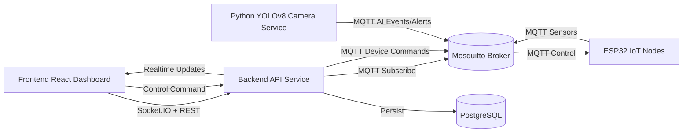

# Smart Mushroom Farm Production Architecture

## Microservices

- frontend: React + Tailwind + Recharts + Socket.IO client
- backend: Node.js + Express + Prisma + PostgreSQL + MQTT + Socket.IO
- ai-camera: Python + OpenCV + YOLOv8 + MQTT publisher
- iot-edge: ESP32 firmware (sensor + relay + local automation)
- infrastructure: PostgreSQL + Mosquitto MQTT broker

## Realtime Flow

1. ESP32 reads DHT22/CO2/water/light.
2. ESP32 publishes MQTT sensor payloads.
3. Backend subscribes MQTT, stores to PostgreSQL, evaluates automation rules.
4. Backend publishes control commands to MQTT for ESP32.
5. Backend emits Socket.IO events to frontend dashboard.
6. AI camera service publishes AI events/alerts via MQTT.
7. Backend broadcasts AI updates and persists alert logs.

## APIs

- REST API for auth, users, zones, sensors, devices, rules, cameras, dashboard.
- Socket.IO for realtime telemetry and control events.
- MQTT for edge and AI telemetry/control channels.

## Security

- JWT authentication for REST endpoints.
- Role-based authorization (ADMIN/OPERATOR/VIEWER).
- CORS constrained by FRONTEND_ORIGIN in backend env.

## Mermaid Diagram

